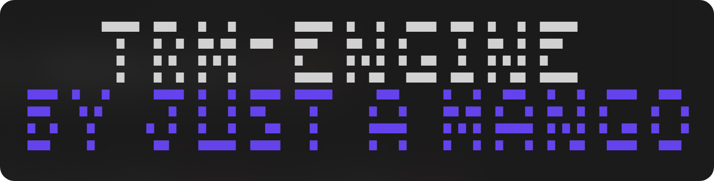

<p align="center">
  <h1 align="center">TRM-ENGINE</h3>

  <p align="center">
    A WIP lightweight and fast game engine which runs in the terminal
    <br/>
    <br/>
    <a href="https://github.com/just-a-mango/trm-engine/issues">Report Bug</a>
    .
    <a href="https://github.com/just-a-mango/trm-engine/issues">Request Feature</a>
  </p>
</p>

## Table Of Contents

- [Table Of Contents](#table-of-contents)
- [About The Project](#about-the-project)
- [Built With](#built-with)
- [Getting Started](#getting-started)
  - [Prerequisites](#prerequisites)
  - [Installation](#installation)
- [Contributing](#contributing)
  - [Creating A Pull Request](#creating-a-pull-request)

## About The Project



trm-engine is a game engine designed to run in the terminal, providing a simple and lightweight platform for developing terminal-based games.

Key Features:

- Object Management: The engine includes an object management system, allowing for easy creation, manipulation, and movement of game objects within the terminal window.
- Size/Performance: The engine offers good performance with a very small bundled size, making it accessible to a wide variety of people and platforms.

trm-engine provides a simple and flexible platform for creating games in the terminal, making it ideal for hobbyist game developers or those looking to learn game development concepts in a lightweight and accessible manner.

## Built With

- Rust 
- crossterm
- fastrand (optional)

## Getting Started

To get a local copy of trm-engine up and running and start creating games/contributing to the engine follow these simple steps.

### Prerequisites

- Git
- Rust
- Cargo

### Installation

1. Clone the repo

```sh
git clone https://github.com/just-a-mango/trm-engine
```

2. Run the project and start creating 🎉

```sh
cd trm-engine && cargo run
```

## Contributing

Any contributions you make are greatly appreciated.

- If you have suggestions for adding or removing projects, feel free to open an issue to discuss it, or directly create a pull request after you edit the README.md file with necessary changes.
- Please make sure you check your spelling and grammar.
- Create individual PR for each suggestion.

### Creating A Pull Request

1. Fork the Project
2. Create your Feature Branch (`git checkout -b feature/AmazingFeature`)
3. Commit your Changes (`git commit -m 'Add some AmazingFeature'`)
4. Push to the Branch (`git push origin feature/AmazingFeature`)
5. Open a Pull Request
